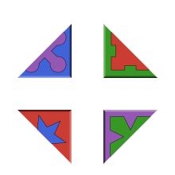
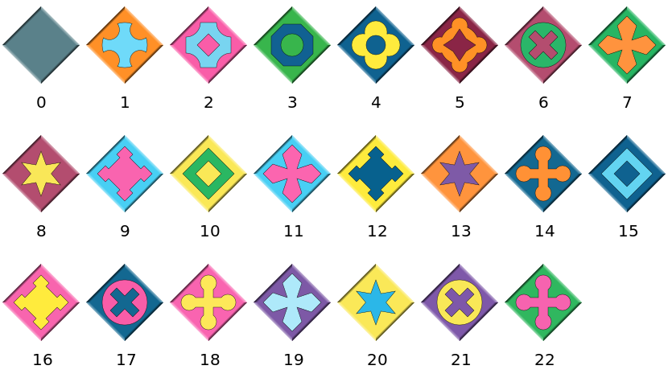
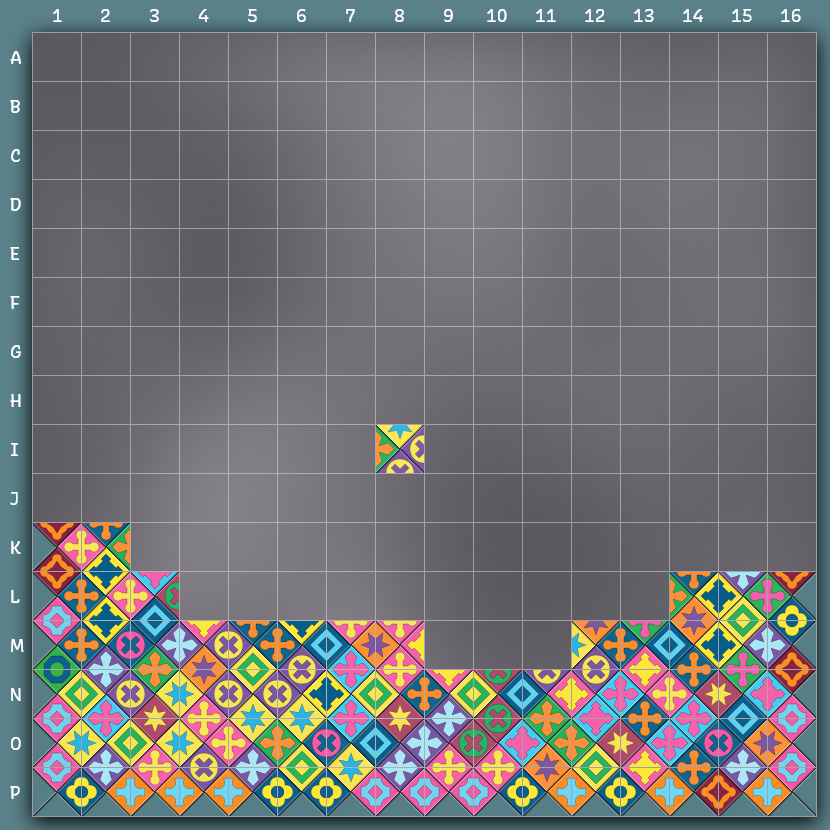

<p>
  <h1 align="center">Eternity2Solvers.jl</h1>
</p>

<p align="center">
  
</p>

Eternity2Solvers.jl is an implementation of the [Eternity II puzzle](https://en.wikipedia.org/wiki/Eternity_II_puzzle) in [Julia](https://julialang.org/).
You can either play the puzzle as an interactive game, or attempt to find a solution using a brute-force backtracking search.


## Installation

```
julia> ]

pkg> add https://github.com/jwortmann/Eternity2Solvers.jl
```

> [!IMPORTANT]
> Please note that the interactive game part of this package might not work correctly on a Mac with Retina display (I have only tested on Windows).


## Instructions

### Rules

The goal is to place all 256 pieces on the board, such that the colors and symbols of adjoining pairs of edges match, and with the grey edges around the outside.
Piece number 139 is a mandatory starter-piece with a fixed position on the board, that can neither be moved nor rotated.

### Puzzle pieces

It is unclear to me whether the original pieces of the Eternity II puzzle are allowed to be published, so for now this package doesn't contain the edge color definitions of those pieces.
It is recommended to specify the pieces in form of an input file, provided that you own the real version of the Eternity II puzzle.
Alternatively, if the piece definitions are not given, they are automatically generated with colors from a published benchmark problem from the META 2010 contest.

A piece definitions file must be in plain text format (*.txt*) and contain 256 rows with four color numbers on each row, separated by spaces; for example

```
1 2 0 0
... (255 more rows)
```

The color numbers must be ordered in clockwise direction, starting with the top side (i.e. top, right, bottom, left).
To reproduce the original pieces from the Eternity II puzzle, use the following numbers:



After creating the file, call the `initialize_pieces` function with the file path:

```julia
julia> using Eternity2Solvers

julia> initialize_pieces("path/to/e2pieces.txt")
```

It is sufficient to do this only a single time after installing the package; the given piece definitions are saved to a persistent cache on disk.
Subsequent calls of `initialize_pieces` override the cache.

### Usage

To play the interactive game, type in the Julia REPL:

```julia
julia> using Eternity2Solvers

julia> play()
```

Puzzle pieces can be moved with the left mouse button and rotated with a right click.

If you prefer to let the computer do the work, generate an empty puzzle board and call the `solve!` function to start the default search algorithm:

```julia
julia> puzzle = Eternity2Puzzle(16, 16)  # or: Eternity2Puzzle(:meta_16x16)
16×16 Eternity2Puzzle with 1 piece:
...

julia> solve!(puzzle)
```

Press and hold <kbd>Ctrl</kbd> + <kbd>C</kbd> in the REPL to stop the search.

To show an image of the puzzle board, you can use
```julia
julia> preview(puzzle)
```

> [!TIP]
> If the code is run within a [Pluto.jl](https://juliahub.com/ui/Packages/General/Pluto) notebook, the board with the puzzle pieces is rendered directly inside the notebook.

The `solve!` function accepts an optional keyword argument `alg`, which should be a subtype of `Eternity2Solver` and selects the algorithm that is used to search for a solution of the given `puzzle`.

To write a custom solve algorithm, define a new subtype of `Eternity2Solver`, and implement the two-argument `solve!` method with your solver type as a second *positional* argument:

```julia
struct MySolver <: Eternity2Solver end

function solve!(puzzle::Eternity2Puzzle, solver::MySolver)
    # ...
end
```

Then you can use an instance of the solver via the `alg` keyword argument:
```julia
julia> puzzle = Eternity2Puzzle(16, 16)

julia> solve!(puzzle; alg=MySolver())
```

In case a solution is found, `solve!` is expected to update the `puzzle.board` array which contains the placements and rotations of all puzzle pieces on the board; see the docstring of `Eternity2Puzzle` for details.


## Preview


