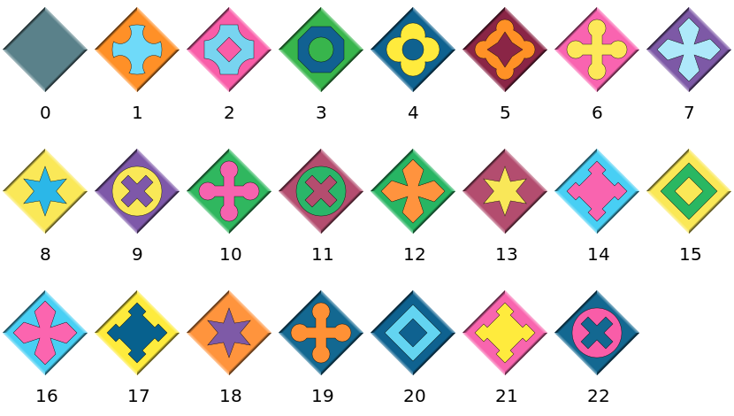

<p>
  <h1 align="center">Eternity2Puzzles.jl</h1>
</p>

<p align="center">
  
</p>

Eternity2Puzzles.jl is an implementation of the [Eternity II puzzle](https://en.wikipedia.org/wiki/Eternity_II_puzzle) in [Julia](https://julialang.org/).
You can either play the puzzle as an interactive game, or attempt to find a solution using a brute-force backtracking search.


## Installation

This package is registered in the General Julia package registry and can be installed using the built-in package manager from the Julia REPL:

```
julia> ]

pkg> add Eternity2Puzzles
```

> [!IMPORTANT]
> Please note that the interactive game part of this package might not work correctly on a Mac with Retina display (I have only tested on Windows).


## Instructions

### Rules

The goal is to place all 256 pieces on the board, such that the colors and symbols of adjoining pairs of edges match, and with the grey edges around the outside.
Piece number 139 is a mandatory starter-piece with a fixed position on the board, that can neither be moved nor rotated.

### Puzzle pieces

The package includes the color definitions for the pieces of the original Eternity II puzzle, the smaller clue puzzles 1, 2 and 4 with board sizes $6\times 6$ and $6\times 12$, as well as benchmark problems with four different board sizes from the META 2010 contest.
Alternatively, the puzzle pieces can be provided in form of an input file in plain text format (*.txt*), containing rows with four color numbers on each row, separated by spaces; for example

```
1 2 0 0
1 3 0 0
...
```

The file can optionally contain a header line with only two numbers, declaring the numbers of rows and columns of the board.
The color numbers must be ordered in clockwise direction, starting with the top side (i.e. top, right, bottom, left).
For the visualization of the pieces on the board with the patterns from the original Eternity II puzzle, use the following color numbers:



### Usage

To play the interactive game, type in the Julia REPL:

```julia
julia> using Eternity2Puzzles

julia> play()
```

Puzzle pieces can be moved with the left mouse button and rotated with a right click.

For the smaller clue puzzles 1, 2 and 4, which can be solved by hand, use `play(:clue1)`, `play(:clue2)` or `play(:clue4)`.

If you prefer to let the computer do the work, generate an empty puzzle board and call the `solve!` function to start the default search algorithm:

```julia
julia> puzzle = Eternity2Puzzle()
16×16 Eternity2Puzzle with 1 piece:
...

julia> solve!(puzzle)
```

Press and hold <kbd>Ctrl</kbd> + <kbd>C</kbd> in the REPL to stop the search.

To show an image of the puzzle board, you can use

```julia
julia> preview(puzzle)
```

> [!TIP]
> If your terminal emulator supports the Sixel graphics format, you can alternatively display the board with the puzzle pieces in form of an image directly inside the REPL by loading the [ImageInTerminal.jl](https://juliahub.com/ui/Packages/General/ImageInTerminal) package.
> It is possible to toggle between text output and image rendering via `ImageInTerminal.disable_encoding()` and `ImageInTerminal.enable_encoding()`.
> Similarly, if the code is run within a [Pluto.jl](https://juliahub.com/ui/Packages/General/Pluto) notebook, the board is automatically rendered as an image inside the notebook.

The `solve!` function accepts an optional keyword argument `alg`, which should be a subtype of `Eternity2Solver` and selects the algorithm that is used to search for a solution of the given `puzzle`.

To write a custom solve algorithm, define a new subtype of `Eternity2Solver`, and implement the two-argument `solve!` method with your solver type as a second *positional* argument:

```julia
struct MySolver <: Eternity2Solver end

function solve!(puzzle::Eternity2Puzzle, solver::MySolver)
    # ...
end
```

Then you can select an instance of the solver with the `alg` keyword argument:

```julia
julia> puzzle = Eternity2Puzzle()

julia> solve!(puzzle; alg=MySolver())
```

In case a solution is found, `solve!` is expected to update the `puzzle.board` array which contains the placements and rotations of all puzzle pieces on the board; see the docstring of `Eternity2Puzzle` for details.

The number of solutions for any given puzzle can be estimated without solving, by using the `estimate_solutions` function:

```julia
julia> puzzle = Eternity2Puzzle()

julia> trunc(Int, estimate_solutions(puzzle))
14702
```

The result is returned as a 128-bit floating point number and the value depends on the board size, the number of different frame and inner color types, the distribution of the colors on the pieces, as well as the number of pre-placed pieces on the board.


## Preview


