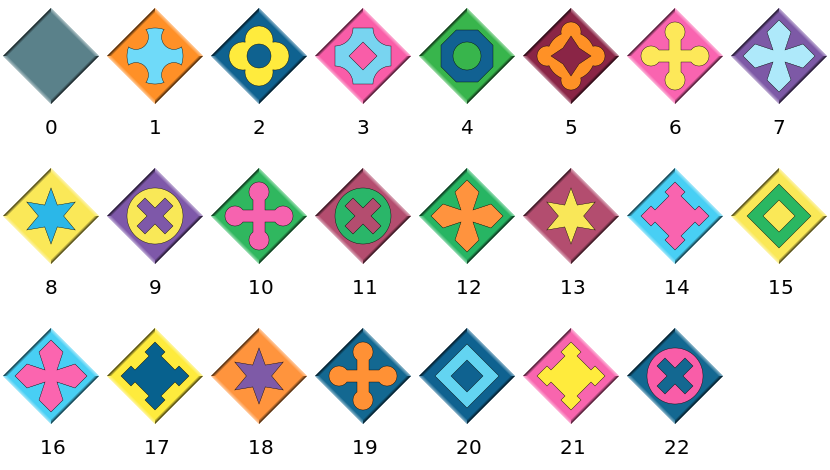

## Installation

!!! compat

    The latest version of `Eternity2Puzzles.jl` requires Julia v1.10 or newer.

`Eternity2Puzzles.jl` is registered in the Julia package registry and can be installed with Julia's [built-in package manager](https://pkgdocs.julialang.org/).
In the Julia REPL press `]` to enter the package mode and run the command

```julia-repl
julia> ]

pkg> add Eternity2Puzzles
```


## Basic usage

In the Julia REPL, first load the package

```julia-repl
julia> using Eternity2Puzzles
```

To start the interactive game in a new window, simply type

```julia-repl
julia> play()
```

Puzzle pieces can be moved with the left mouse button and rotated with a right click.
The goal is to place all 256 pieces on the board, such that the colors and symbols of adjoining pairs of edges match, and with the grey edges around the outside.
Piece number 139 is a mandatory starter-piece with a fixed position on the board, that can neither be moved nor rotated.

You can also use the following commands to play one of the smaller clue puzzles:

```julia-repl
julia> play(:clue1)

julia> play(:clue2)

julia> play(:clue4)
```

!!! warning

    Please note that the package is only tested on Windows and that the interactive game part might not work correctly on a Mac with Retina display.

The basic type provided by this package is [`Eternity2Puzzle`](@ref).
This type represents a puzzle with the piece arrangement on the board and the edge color definitions for the pieces.
A puzzle instance with the original Eternity II pieces and with an empty board can be created using the default constructor:

```@repl
using Eternity2Puzzles  # hide
puzzle = Eternity2Puzzle()
```

The output shows a representation of the board, with the piece numbers and with the piece rotations as number of quarter rotations in clockwise direction.
For the default puzzle there is only the starter-piece pre-placed on square I8, and the other squares that don't have numbers on them are empty.

A custom definition for the edge colors of the puzzle pieces can be loaded from a file by passing the filepath as an argument to the [`Eternity2Puzzle`](@ref) constructor:

```julia-repl
julia> puzzle = Eternity2Puzzle("path/to/e2pieces.txt")
```

Such an input file must be in plain text format and contain lines with four color numbers on each line, separated by spaces.
The numbers of rows and columns of the board can optionally be specified on the first line; for example

```
16 16
0 0 1 2
0 0 1 3
...
```

The color numbers for each piece are ordered in clockwise direction, starting with the bottom side (i.e. bottom, left, top, right).
The numbering convention for the different color patterns is shown in the [Color patterns](@ref) section below.

The constructor accepts more arguments to specify the board size if it is not given in the input file, or in order to force a different board size, and also to create puzzles with other predefined or randomly generated sets of pieces.
For more details please see the description in the [API Reference](@ref).

Call the [`solve!`](@ref) function to start the default backtracking search algorithm.
You can press and hold `Ctrl` + `C` in the REPL to stop the search.

```julia-repl
julia> solve!(puzzle)
```

To open a visualization of the puzzle board use

```julia-repl
julia> preview(puzzle)
```

!!! tip

    If your terminal emulator supports the Sixel graphics format, the puzzle board can also be displayed in form of an image directly inside the REPL by loading the [ImageInTerminal.jl](https://juliahub.com/ui/Packages/General/ImageInTerminal) package.
    It is possible to toggle between the regular text output and image rendering using the `ImageInTerminal.disable_encoding()` and `ImageInTerminal.enable_encoding()` functions.

The [`solve!`](@ref) function accepts an optional keyword argument `alg`, which should a subtype of [`Eternity2Solver`](@ref) and selects the algorithm that is used to search for a solution of the given [`Eternity2Puzzle`](@ref).

To write a custom solver algorithm, define a new subtype of [`Eternity2Solver`](@ref) and implement a two-argument `solve!` method with your solver type as the type of the second *positional* argument:

```julia
struct MySolver <: Eternity2Solver end

function solve!(puzzle::Eternity2Puzzle, solver::MySolver)
    # ...
end
```

Then you can use an instance of the solver with the `alg` keyword argument:

```julia-repl
julia> solve!(puzzle; alg=MySolver())
```

The `solve!` method with a single positional argument is just a thin wrapper that dispatches on the different solver types, handles keyboard interrupts and displays the elapsed time.

In case a solution is found, the custom `solve!` implementation is expected to update the `puzzle.board` array which contains the arrangement and the rotations for all puzzle pieces on the board, see [`Eternity2Puzzle`](@ref) for details.

The number of solutions for any [`Eternity2Puzzle`](@ref) can be estimated without solving the puzzle with the [`estimate_solutions`](@ref) function:

```@repl
using Eternity2Puzzles  # hide
puzzle = Eternity2Puzzle();
solutions, nodes = estimate_solutions(puzzle)
trunc(Int, solutions)
```

The return values of this function are the estimated number of solutions and the estimated number of nodes in the search tree for a backtracking search algorithm, as 128-bit floating point numbers.
These values depend on the board size, the pre-placed pieces on the board, the numbers of different frame and inner color types, the frequencies/distribution of the colors over the pieces, and more.
[`estimate_solutions`](@ref) accepts additional arguments that control permitted invalid joins and the placement order for a backtracking search.


## Color patterns

The following numbering convention for the different color patterns is used by this package:



For the solver algorithms and for other functions provided by this package it is not strictly necessary that the edge colors that are specified in an input file follow this numbering, except for the border color which must always be 0.
